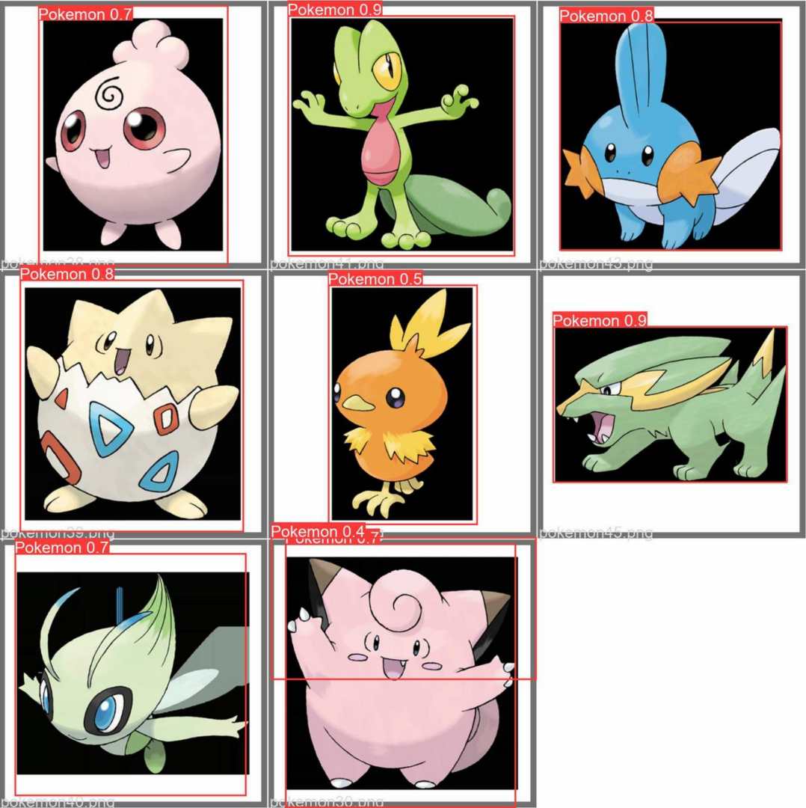
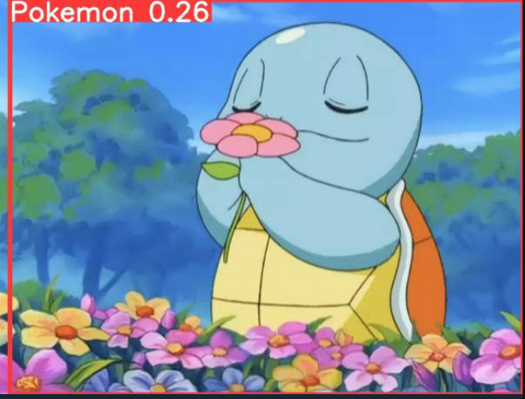
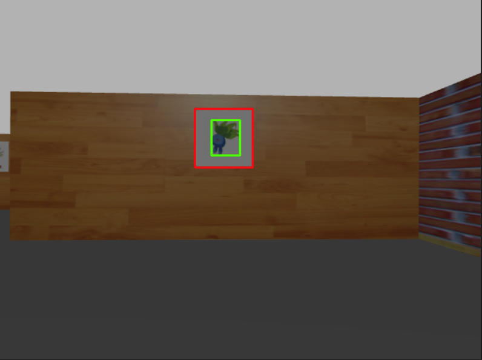

# Project Report

[TOC]

## Background

### Environment

`Ubuntu20.04 + ROS Noetic + Python3.8.2 + OpenCV4.5.5	`	

### Purpose

1. Implement auto driving and exploration within 3~7 minutes
2. Auto identification (detect and grab naughty pokemon in a maze)
3. (bonus) Multiple robots

### Judging Standard 

#### General:

#### Time:

## 

### Function

| Function               | Done | Improvement |
| ---------------------- | ---- | ----------- |
| Auto exploration       | Yes  |             |
| Pokemon Identification | Yes  | Accuracy    |
| Pokemon grab           | Yes  |             |
| Multi-robots           | No   |             |

## Modules

### Exploration

### Pokemon Identification

To solve the pokemon identification problem, we have mainly two method. 

One is based on learning model. For example, we can choose YOLO to train our model to detect and identify pokemon.

The other is to solve by pure OpenCV method.

But whatever, we have to firstly determine when to indentify. We don’t want to find pokemon in any time since our pokemon only appears in the pictures.

An image with proper picture to catch may look like this:

An image with proper picture to catch may look like this:

Our first task is to determine whether it is a proper time to catch pokemon and crop the picture if it is.

#### 1. Rectangle detection and Crop the desiring area

We can detect the picture by the property that it has white background.

We convert the photo that comes from our robot to Black and White.

With our example:

Then, we just need to find the proper rectangle.

Obviously, we hope the x and y of the rectangle to be close. And we don’t want small x and y since there may be some small rectangles that don’t meet our expectation.

Once the rectangle satisfies our requirements, we store it’s coordinates(in order to mark in the origin image) and crop it.

#### 2. detect the pokemon

And then we can detect pokemon easily with OpenCV method. But I also tried YOLO method. 

Labelled some pokemon pictures using `labelImg`. 

Due to the limit of my computer(darknet doesn’t support gpu speed up for amd), I appointed my friend to train the model. And here are some results he returned to me:

It runs properly in origin dataset. But when it comes to a picture with pokemon in a complex environment, it works awful:

Maybe I should prepare a more colourful dataset. But whatever, I just test it to satisfy my curiosity.

I will choose the pure OpenCV method to finish my project for better result.

In the first step, we have get the black and white image of the picture. Then it’s easy to  addressed with in fact. We just call the `boundingRect()` function.

 

#### 3. Combine and congratulation!

Then we will have this:

####  

More testing examples: 

## reference list

OpenCV Contours: https://docs.opencv.org/4.5.5/d3/d05/tutorial_py_table_of_contents_contours.html

Wall follower algorithm and PID control: https://github.com/juandpenan/turtlebot3_wall_follower

OpenCV tutorial for saving Images:

http://opencv-python-tutroals.readthedocs.org/en/latest/py_tutorials/py_gui/py_image_display/py_image_display.html

